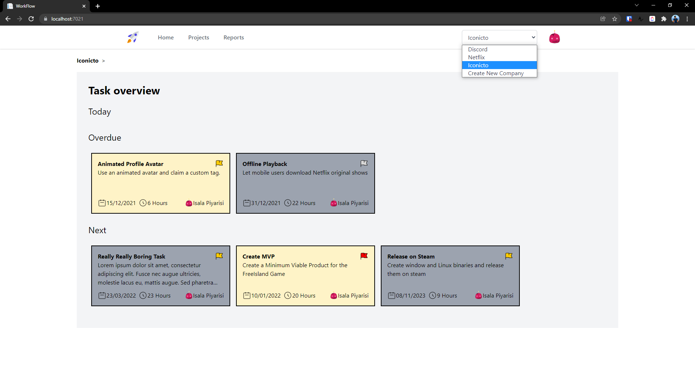
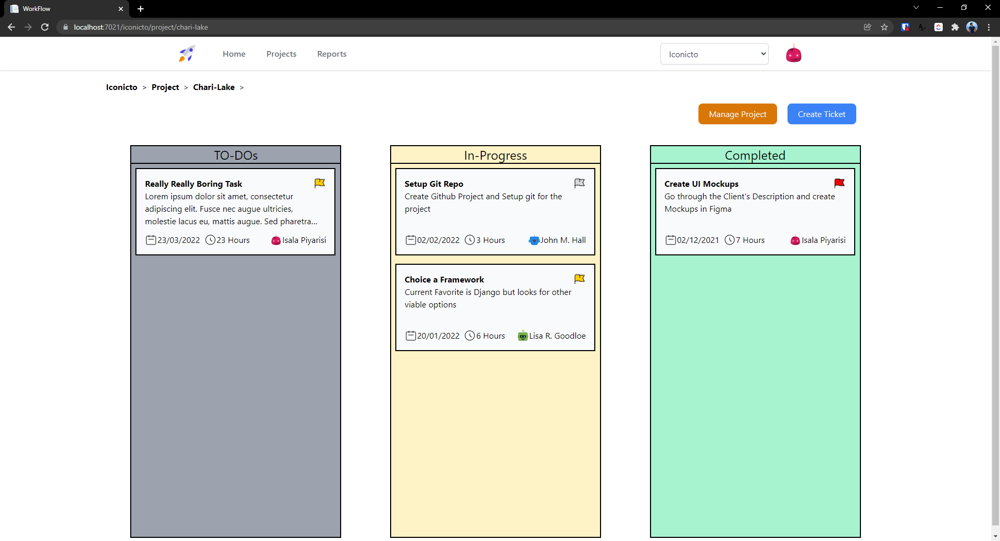
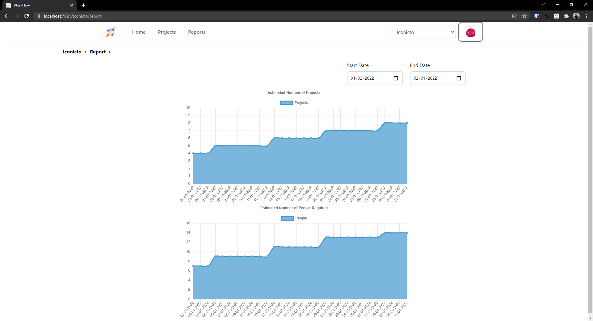
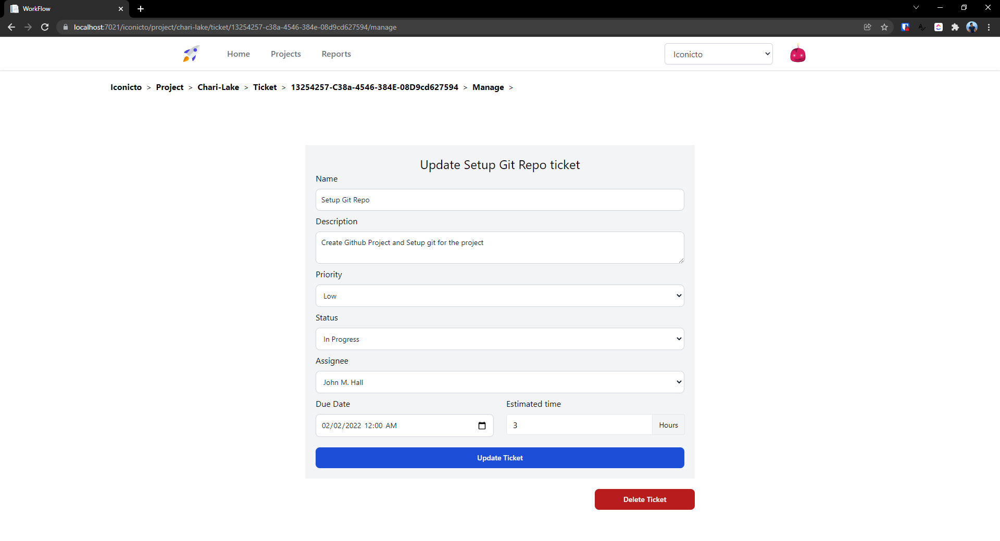
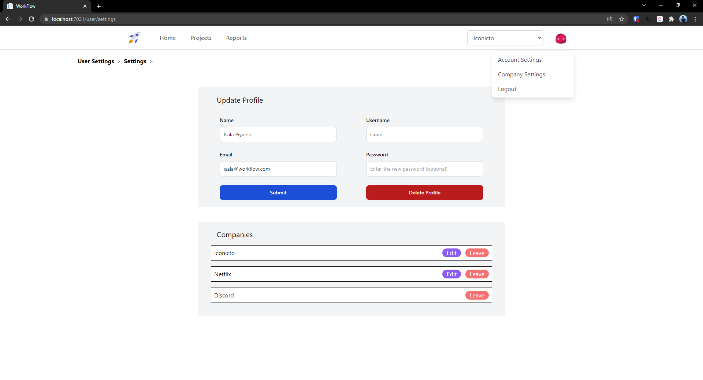
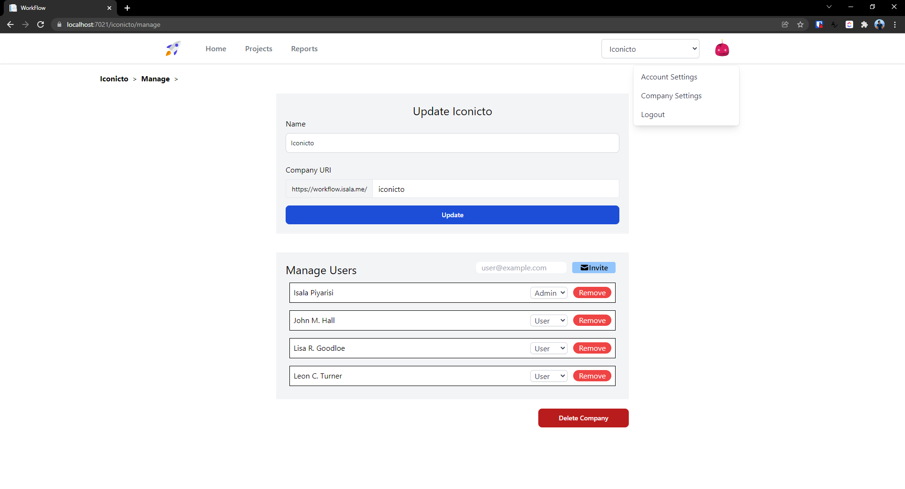

# Workflow

Workflow is a project management software that will help you to manage project of small to medium scale. This provides simple and easy to use Kanban board track the progress of the project. In the users can create multiple organizations and multiple projects in them and users can work across many projects and companies. 

This was mainly developed to show case my skills of creating enterprise grade applications using **.NET 6** as the backend **Blazor** to render the frontend UIs.

## Demo - https://workflow.isala.me/
Username - suffect \
Password - Abcd@1234
> Note: Database will be resetted after each session

## Run locally

### Development
> Note: .NET 6.0 SDK needs to be installed
```bash
git clone https://github.com/MrSupiri/WorkFlow.git
cd WorkFlow/WorkFlow/Server
dotnet run "WorkFlow.Server.csproj"
```

### Preview
```bash
docker run --rm -p 5021:443 -p 7021:80 ghcr.io/mrsupiri/workflow:latest
```

### Screenshots
#### Home Page

#### Kanban Board

#### Report Forecasting

#### Edit Ticket

#### User Settings

#### Company Settings
